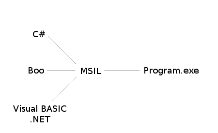

Boo is an amazing language that combines the syntactic sugar of [Python](http://www.python.org/),
the features of [Ruby](http://www.ruby-lang.org/), and the speed and safety of
[C#](http://msdn.microsoft.com/vcsharp/).

Like C#, Boo is a statically-typed language, which means that types are important. This adds a
degree of safety that Python and other dynamically-typed languages do not currently provide.

It fakes being a dynamically-typed language by inference. This makes it seem much like Python's
simple and programmer-friendly syntax.

```csharp
int i = 0;
MyClass m = new MyClass();
```

```boo
i = 0
m = MyClass()
```


## Hello, World!

A [Hello, World!](http://en.wikipedia.org/wiki/Hello_world_program) program is very simple in Boo.

Don't worry if you don't understand it, I'll go through it one step at a time.

```boo
print "Hello, World!"
//    OR
print("Hello, World!")
```

Output:

    Hello, World!
    Hello, World!

1. First, you must compile the helloworld.boo file to an executable.
  1. Open up a new [command line](https://github.com/bamboo/boo/wiki/Command-line)
  2. `cd` into the directory where you placed the `helloworld.boo` file.
  3. `booc helloworld.boo` (this assumes that Boo is installed and in your [system path](https://github.com/bamboo/boo/wiki/Adding-Boo-to-your-System-Path))
  4. `helloworld.exe`
  5. If you are using [Mono](http://www.go-mono.com/), `mono helloworld.exe`
2. Using the print macro, it prints the string "Hello, World!" to the screen. OR
3. Using the print function, it prints the string "Hello, World!" to the screen.

Now these both in the end, do the same thing. They both call `System.Console.WriteLine("Hello, World")`
from the .NET Standard Library.

!!! hint
    Using the macro version `print "Hello, World!"` is recommended.

And it's that simple.


## Comparing code between Boo, C#, and VB.NET

Now you may be wondering how Boo could be as fast as C# or VB.NET.

Using their Hello World programs, I'll show you.

**Boo:**

```boo
print "Hello World!"

// Output: Hello World!
```

**CSharp:**

```csharp
public class Hello
{
  public static void Main()
  {
    System.Console.WriteLine("Hello World!");
  }
}

// Output: Hello World!
```

**VB.NET:**

```vbnet
Public Class Hello
  Public Shared Sub Main()
    System.Console.WriteLine("Hello World!")
  End Sub
End Class

' Output: Hello World!
```

All three have the same end result and all three are run in the .NET Framework.

All three are first translated into MSIL, then into executable files.



If you were to take the executables created by their compilers, and disassemble them with
`ildasm.exe`, you would see a very similar end result, which means that the executables
themselves are very similar, so the speed between C# and Boo is practically the same, it
just takes less time to write the Boo code.


## Booish

`booish` is a command line utility that provides a realtime environment to code boo in. It
is great for testing purposes, and I recommend following along for the next few pages by
trying out a few things in `booish`.

You can invoke it by loading up a terminal, then typing booish (this assumes that Boo is
installed and in your system path), or by double-clicking the booish icon. In `booish`, you
can up arrow to re-enter (with editing) a previously entered line.

Here's what `booish` will look like:

    >>> print "Hello, World!"
    Hello, World!
    >>>


## Exercises

1. Write a Boo program that prints `Hello, World!`, then prints `Goodbye, World!`
2. Play around with `booish`
3. Advanced: Compile the Hello, World! programs for Boo (using `booc`) and C#
   (using `csc` or `mcs`), run `ildasm` on each of them and compare the result.

